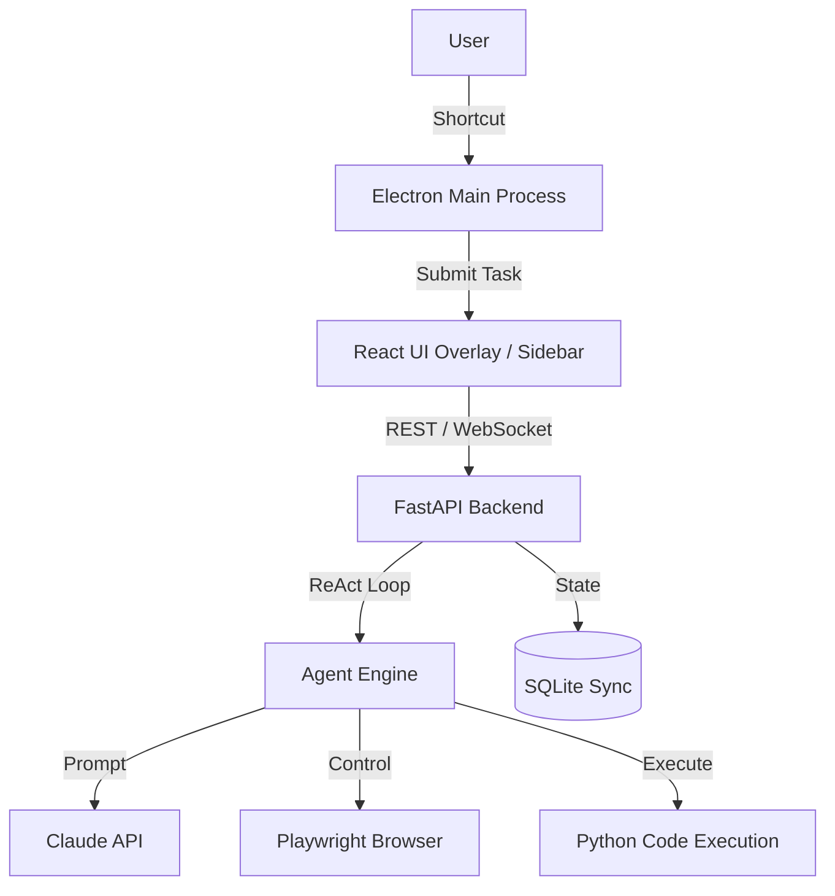

# ARIA — Master Project File
Last Updated: 2026-03-29
Build Phase: Phase 1 — Foundation
Status: Core architecture complete. API key needed. Ready for real task validation.

---

## 1. WHAT WE ARE BUILDING
ARIA (Autonomous Reasoning & Intelligence Agent) is a local AI agent platform that runs on your computer. It allows users to submit natural language commands via a global keyboard shortcut (Ctrl+Shift+Space or Cmd+Shift+Space), triggering an invisible AI assistant that executes real-world tasks autonomously while the user continues their work, with a sidebar showing live progress.

The end-to-end user experience is seamless and unobtrusive. You press the shortcut, type a command like "Research top AI startups and save a CSV to my desktop", and the overlay disappears. A subtle sidebar slides in, showing the agent thinking, opening a hidden browser, navigating, extracting data, and writing the file. Once finished, it marks the task complete and gets out of your way.

This matters because current AI tools are passive chatbots that require constant hand-holding and back-and-forth prompting. ARIA shifts the paradigm from "chatting with AI" to "delegating to AI" by integrating deeply with the desktop OS, owning browser sessions, and executing code locally, making it a true autonomous worker rather than just a conversational assistant.

## 2. THE VISION (Where This Is Going)
- **Local On-Device LLM Support:** Integration with Ollama for zero-cost, fully private, offline task execution.
- **Skill & Plugin Marketplace:** A community-driven ecosystem where users can download new capabilities (e.g., "Slack Integration", "AWS Management").
- **Scheduled & Recurring Tasks:** The ability to run specific agents hourly, daily, or on specific system events.
- **Multi-Step Dependent Workflows:** Chaining agents together (e.g., Agent A scrapes data -> Agent B writes a report -> Agent C emails it).
- **Vision & Screen Control:** Full computer use capabilities allowing the agent to "see" the screen and control apps that lack APIs.
- **Enterprise & Team Collaboration:** Shared agent memory, role-based workflows, and organizational deployment.
- **Cross-Platform Native Builds:** Polish native installers for Windows (NSIS), MacOS (DMG), and Linux (AppImage).

## 3. CURRENT PROTOTYPE GOAL
The prototype must demonstrate a flawless, end-to-end autonomous execution of a single web-based task using the Claude API. "Done" for the prototype looks like a user hitting the global shortcut, entering a command, and the agent successfully using Playwright to navigate the web, extract data, and save a result to the local hard drive, all while real-time updates render smoothly in the React frontend.

## 4. ARCHITECTURE — HOW THE SYSTEM WORKS
ARIA is composed of three decoupled layers: an Electron desktop shell that manages the UI windows and OS shortcuts, a React Vite frontend that renders the minimal UI components, and a Python FastAPI backend that orchestrates the AI agents and browser automation.

- **Electron Shell:** Lives in `electron/`. Uses Node.js to register global OS shortcuts, manage a hidden system tray application, and spawn two transparent browser windows (one for the input overlay, one for the progress sidebar). It also spawns the Python process.
- **Frontend Layer:** Lives in `frontend/`. Built with React 18, Vite, TailwindCSS, and Zustand. It connects to the backend via WebSockets to receive instant, real-time updates for every agent step and renders them cleanly.
- **Backend / Agent Core:** Lives in `backend/`. Built with FastAPI. It handles the core ReAct (Reasoning and Acting) loop, using `anthropic` to talk to Claude, `playwright` for invisible fast browser scraping, and `aiosqlite` for local state persistence. Chosen for Python's robust AI and data tooling ecosystem.

## 5. FULL FILE STRUCTURE WITH EXPLANATIONS
- **`MASTER.md`**: The single source of truth for the project, tracking vision, architecture, and task status.
- **`README.md`**: Standard brief overview for git repositories.
- **`.env`** / **`.env.example`**: Configuration variables, including API keys and ports.
- **`.gitignore`**: Excludes `node_modules`, `venv`, compiled files, and secrets from version control.
- **`backend/main.py`**: The FastAPI entry point containing REST endpoints and the WebSocket server for real-time updates.
- **`backend/config.py`**: Loads environment variables and provides typed, validated settings for the backend.
- **`backend/requirements.txt`**: Specifies Python dependencies (FastAPI, uvicorn, playwright, anthropic, etc).
- **`backend/core/agent.py`**: The core ReAct loop that makes Claude think, use tools, and observe results iteratively.
- **`backend/core/broadcaster.py`**: Manages active WebSocket connections and broadcasts real-time task updates to the UI.
- **`backend/core/router.py`**: Uses heuristics to classify raw user task descriptions (e.g., "web", "code", "api") for optimized routing.
- **`backend/core/task_manager.py`**: Orchestrates concurrency with an asyncio semaphore to limit running tasks.
- **`backend/db/database.py`**: Initializes the SQLite database and provides connection contexts.
- **`backend/db/models.py`**: Pydantic/dataclass definitions representing Tasks and execution Steps.
- **`backend/db/queries.py`**: Encapsulates all SQL statements for inserting and retrieving tasks and steps.
- **`backend/tools/__init__.py`**: Tool package initializer.
- **`backend/tools/registry.py`**: The central registry defining the JSON schema for every tool available to the LLM.
- **`backend/tools/browser_tools.py`**: Implements Playwright functions for web navigation, clicking, typing, and extraction.
- **`backend/tools/code_tools.py`**: Safety-restricted functions for executing Python code strings and writing files.
- **`backend/tools/screen_tools.py`**: Placeholder for future visual UI interaction tools.
- **`backend/utils/logger.py`**: Custom structured logging configuration for the backend.
- **`backend/utils/sanitizer.py`**: Utilities to truncate large string outputs (like huge HTML blobs) before saving/sending.
- **`electron/main.js`**: The main Node process managing Electron windows, system tray, global shortcuts, and launching Python.
- **`electron/preload.js`**: Context bridge allowing secure IPC communication between the React frontend and Electron main process.
- **`electron/package.json`**: NPM configuration, scripts, and dependencies for the Electron shell.
- **`frontend/package.json`**: NPM configuration, scripts, and React/Tailwind/Vite dependencies for the frontend.
- **`frontend/vite.config.js`**: Configuration for the Vite bundler.
- **`frontend/tailwind.config.js`**: Tailwind CSS theme and styling configuration.
- **`frontend/postcss.config.js`**: PostCSS plugins configuration used by Tailwind.
- **`frontend/index.html`**: The root HTML file serving the React application.
- **`frontend/src/main.jsx`**: The React DOM mounting script.
- **`frontend/src/App.jsx`**: The root React component that routes between the Overlay and Sidebar window modes.
- **`frontend/src/index.css`**: Global CSS imports and base Tailwind directives.
- **`frontend/src/store/taskStore.js`**: Zustand store managing local state for tasks, steps, and UI visibility.
- **`frontend/src/hooks/useTasks.js`**: React hook for querying and manipulating tasks.
- **`frontend/src/hooks/useWebSocket.js`**: React hook that connects to the backend WebSocket and hydrates the Redux/Zustand store.
- **`frontend/src/components/Overlay/Overlay.jsx`**: The search-bar-like command input UI that appears globally.
- **`frontend/src/components/Overlay/Overlay.css`**: Animations and specific styles for the overlay.
- **`frontend/src/components/Sidebar/Sidebar.jsx`**: The sliding right-hand panel displaying all active and complete tasks.
- **`frontend/src/components/Sidebar/Sidebar.css`**: Animations and styling for the sidebar.
- **`frontend/src/components/Sidebar/TaskCard.jsx`**: A summary card for a distinct task in the sidebar list.
- **`frontend/src/components/Sidebar/TaskDetail.jsx`**: A detailed view showing every internal thought and step of a specific task.
- **`frontend/src/components/shared/ProgressBar.jsx`**: Reusable component for displaying task execution progress.
- **`frontend/src/components/shared/StatusBadge.jsx`**: UI element indicating if a task is running, complete, or failed.
- **`scripts/setup.ps1`**: Automated script to create Python venv, install Python/Node deps, and setup Playwright.
- **`scripts/smoke_test.py`**: Basic automated tests to verify core logic without UI overhead.
- **`scripts/start-dev.ps1`**: Development script firing up FastAPI, Vite, and Electron simultaneously locally.

## 6. WHAT IS COMPLETE — VERIFIED
- [ x ] Electron Shell Structure
  - Spawns invisible windows, registers global keyboard shortcuts, creates a system tray.
  - `electron/main.js`, `electron/preload.js`
  - Verify: Run `scripts/start-dev.ps1`, verify system tray icon exists and shortcut opens UI.
- [ x ] React Frontend & UI Components
  - Complete Vite project with Overlay, Sidebar, Task store, and WebSocket integration.
  - `frontend/src/*`
  - Verify: UI visually renders perfectly on start without error.
- [ x ] Backend API & WebSocket
  - FastAPI serving endpoints and WebSocket connections, storing to SQLite.
  - `backend/main.py`, `backend/db/*`, `backend/core/broadcaster.py`
  - Verify: Connects successfully from frontend, sends "task_created" broadcast.
- [ x ] ReAct Loop Engine
  - LLM integration, tool registry, Playwright integration, basic flow control.
  - `backend/core/agent.py`, `backend/tools/*`
  - Verify: Code logically complete and syntactically correct, ready to run.
- [ x ] Development Scripts
  - Seamless setup and start PowerShell scripts.
  - `scripts/setup.ps1`, `scripts/start-dev.ps1`
  - Verify: Running `./scripts/start-dev.ps1` spins up everything without crashing.

## 7. WHAT IS IN PROGRESS
- [ ~ ] End-to-End Task Validation
  - Core logic and UI exist and function up until LLM execution.
  - Missing: Needs a valid `ANTHROPIC_API_KEY` to actually ping Claude and verify tool usage accuracy.
  - Exact file to open and what to add: Open `.env` and add a valid api key for `ANTHROPIC_API_KEY`.

## 8. WHAT IS NOT STARTED — ORDERED BY PRIORITY

### TASK: End-to-End Real Task Validation
Priority: CRITICAL — Do This First
Depends on: Valid ANTHROPIC_API_KEY in .env
Owner: Backend Dev 1
Estimated complexity: Small
Files to edit: .env only to start, then agent.py if loop behavior needs tuning
What to build: Add the real API key. Submit this exact task through the UI: "Go to news.ycombinator.com, get the titles of the top 5 stories, and save them to hn_test.json". Watch the terminal logs line by line. Fix any error that appears until the file exists on disk with real data.
Definition of done: hn_test.json exists in ~/ARIA/outputs/ with 5 real story titles. Task card in sidebar shows green. No errors in terminal.

### TASK: Tool Isolation Testing
Priority: CRITICAL — Do This In Parallel With Above
Depends on: Valid ANTHROPIC_API_KEY
Owner: Backend Dev 2
Estimated complexity: Small
Files to create: scripts/tools_test.py
What to build: A standalone Python script that imports and calls each tool directly with hardcoded inputs. Test each one: browser_navigate (go to google.com, print title), browser_extract (extract text from example.com), write_file (write hello to test.txt, verify it exists), run_python (execute 2+2, verify output is 4). Print PASS or FAIL for each.
Definition of done: Every tool prints PASS. Any failing tool is fixed before this task is closed.

### TASK: UI State Audit
Priority: High
Depends on: Nothing — can start immediately
Owner: Frontend Dev
Estimated complexity: Small
Files to edit: frontend/src/components/*
What to build: Manually trigger every UI state and verify it looks correct: empty sidebar (no tasks), task card in queued state, task card in running state with live step text, task card in completed state with green indicator, task card in failed state with red indicator, expanded task detail view with step log. Fix any state that looks broken, missing, or does not match the design spec in this file.
Definition of done: All 6 states verified visually. Screenshots taken and shared with Lead.

### TASK: Parallel Demo Validation
Priority: High
Depends on: End-to-End Real Task Validation
Owner: Lead
Estimated complexity: Small
Files to edit: None — this is a test task
What to build: Submit 3 tasks simultaneously through the UI. Verify all 3 appear in sidebar as running at the same time. Verify all 3 complete with separate output files. Verify no task blocks or crashes another.
Definition of done: 3 tasks run in parallel, 3 separate output files exist, sidebar showed all 3 as running simultaneously.

### TASK: Configure Anthropic API Key & Verify Agent Loop
Priority: High
Depends on: None
Estimated complexity: Small
Files to create or edit: `.env`, `backend/core/agent.py` (if tweaking needed)
What to build: Inject a valid `ANTHROPIC_API_KEY` into `.env`, submit a real test command (e.g. "Go to example.com and extract header"), and observe the ReAct loop handle it perfectly.
Definition of done: The agent successfully completes a web browsing task autonomously, extracts knowledge, and outputs a file or summary.

### TASK: Local LLM (Ollama) Support
Priority: Medium
Depends on: Configure Anthropic API Key & Verify Agent Loop
Estimated complexity: Large
Files to create or edit: `backend/core/agent.py`, `backend/config.py`
What to build: Modify the agent loop to add an alternative client utilizing the `ollama` Python library, allowing execution entirely locally on hardware instead of relying on Claude. Ensure tool definitions are compatible with open weights models.
Definition of done: User can select a local model via config to execute a simple task completely offline.

### TASK: Skill / Plugin Marketplace Architecture
Priority: Medium
Depends on: Configure Anthropic API Key & Verify Agent Loop
Estimated complexity: Large
Files to create or edit: `backend/tools/dynamic_loader.py`, `backend/models/plugin.py`
What to build: Create a system for dynamically loading python files as "skills" that extend the `TOOL_REGISTRY`. Allow the Frontend to display available skills.
Definition of done: A user can drop a `.py` skill file into a plugins folder, restart, and the agent can suddenly use a new external service tool without hardcoded changes.

### TASK: Scheduled / Recurring Tasks
Priority: Low
Depends on: End-to-End Validation
Estimated complexity: Medium
Files to create or edit: `backend/core/scheduler.py`, DB schema updates
What to build: Add a cron-like scheduler loop that periodically reads the DB for recurring tasks and submits them to the `task_manager` queue.
Definition of done: User can define a task to "Run every hour", and ARIA logs the execution automatically.

## TEAM OWNERSHIP

| Module | Owner | Files Owned |
|--------|-------|-------------|
| Agent Core & LLM Loop | Backend Dev 1 | backend/core/agent.py, backend/core/router.py, backend/core/task_manager.py |
| Tools & Browser Automation | Backend Dev 2 | backend/tools/*, backend/core/broadcaster.py |
| Frontend & Electron UI | Frontend Dev | frontend/src/*, electron/main.js, electron/preload.js |
| Infrastructure & Testing | Generalist | backend/db/*, backend/utils/*, scripts/*, MASTER.md |
| Architecture & Integration | Lead | All files — review only, no direct module ownership |

Rules:
- You make all decisions inside your module
- You ask Lead before changing anything outside your module
- You update MASTER.md every time you complete or start something

## 9. THE DEMO SCRIPT
1. Ensure the machine is fresh and `scripts/setup.ps1` has been run.
2. Provide a valid `.env` with `ANTHROPIC_API_KEY`.
3. Run `.\scripts\start-dev.ps1`. Wait for "App ready. Press Control+Shift+Space" in terminal.
4. Press `Ctrl+Shift+Space` (or Cmd+Shift+Space on Mac). Verify the sleek Overlay appears centered on screen.
5. Search bar: type "Go to hacker news, get the top 3 stories, and save them to a file named hn_top.json" and press Enter.
6. Verify the Overlay vanishes immediately.
7. Verify the Sidebar slides in from the right. A new task appears labeled "running".
8. In the sidebar, click the task to expand steps.
9. Watch as steps populate in real-time: "Navigating to ...", "Extracting ...", "Writing file ...".
10. Wait ~15 seconds. Verify the task state updates to "Complete".
11. Right click system tray -> "Open Output Folder".
12. Verify `hn_top.json` exists locally containing accurate data.

## 10. HOW TO RUN THE PROJECT
1. Fresh Machine Setup: Open a PowerShell terminal as Administrator (or standard user with execution bypass rights).
2. Navigate to project root: `cd \path\to\ARIA` (or `Newato` in this environment)
3. Run the setup: `.\scripts\setup.ps1` (This creates the Python venv, installs NPM packages, installs Playwright browsers, and creates a `.env` file).
4. Configuration: Open `.env` and paste your valid `ANTHROPIC_API_KEY`.
5. Start Dev Server: Run `.\scripts\start-dev.ps1`. This spins up the FastAPI backend, the Vite frontend dev server, and launches Electron.
6. The app minimizes to the system tray. Use `Ctrl+Shift+Space` to summon the agent.

## 11. ENVIRONMENT VARIABLES
- `ANTHROPIC_API_KEY` (Required): The API key for Claude. Tasks fail fast with 401 if missing or invalid.
- `ARIA_OUTPUT_DIR` (Optional): Where agents write physical files. Default: `~/ARIA/outputs`.
- `ARIA_MAX_CONCURRENT_TASKS` (Optional): Limits simultaneous parallel task execution. Default: `4`.
- `ARIA_WEBSOCKET_PORT` (Optional): Port for IPC. Default: `8765`.
- `ARIA_MAX_STEPS_PER_TASK` (Optional): Hard limit on agent loop steps. Default: `40`.
- `ARIA_TASK_TIMEOUT_SECONDS` (Optional): Wall-clock guardrail. Default: `300`.
- `LOG_LEVEL` (Optional): Logging verbosity. Default: `INFO`.

## 12. KNOWN ISSUES AND BLOCKERS
- **The 401 Unauthorized Blocker:** 
  - *What the problem is:* Submitting a task immediately results in task failure and a `401 Unauthorized` API error from Anthropic.
  - *Why it happens:* The `ANTHROPIC_API_KEY` in the `.env` file is either empty or invalid, so the initial authentication for the ReAct loop is rejected.
  - *How to fix it:* Insert a valid Anthropics API key into `.env` at the project root.

## 13. DECISIONS LOG
- **Electron over Native (Swift/C++):** Decided heavily in favor of Electron for rapid, cross-platform iteration and because standard web tech combined with Python covers all required capability.
- **Python over Node for Backend:** Python chosen for backend despite Electron using Node due to Python's undeniably superior ecosystem for data extraction (Playwright), AI engineering (LangChain/Anthropic SDK), and numerical reasoning.
- **SQLite Database:** Decided against PostgreSQL to ensure the app is a 100% self-contained local desktop application with zero external infrastructure dependencies.
- **WebSocket IPC rather than normal Electron IPCMain:** Keeps the python backend entirely decoupled from Electron. The backend could theoretically be hosted on a separate server without code changes.

## 14. TEAM WORKING RULES
- Always read MASTER.md before starting any work
- Always update MASTER.md before ending any session
- Never mark a task complete unless it runs
- Every new file created must be added to the file structure section with its explanation
- Every architectural decision must be logged in the Decisions Log

---
